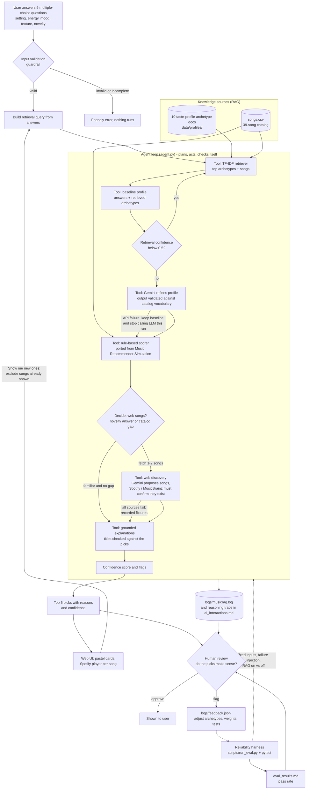

# System Diagram, Version 2

Source of truth: `architecture.mmd`. Rendered by GitHub below. Version 1 is `architecture_v1.md`.

```mermaid
flowchart TD
    U["User answers 5 multiple-choice questions<br/>setting, energy, mood, texture, novelty"] --> V{"Input validation<br/>guardrail"}
    V -->|"invalid or incomplete"| E["Friendly error, nothing runs"]
    V -->|valid| Q["Build retrieval query from answers"]

    subgraph KB["Knowledge sources (RAG)"]
        A[("10 taste-profile archetype docs<br/>data/profiles/")]
        C[("songs.csv<br/>39-song catalog")]
    end

    subgraph AG["Agent loop (agent.py) - plans, acts, checks itself"]
        R["Tool: TF-IDF retriever<br/>top archetypes + songs"]
        B["Tool: baseline profile<br/>answers + retrieved archetypes"]
        D1{"Retrieval confidence<br/>below 0.5?"}
        L["Tool: Gemini refines profile<br/>output validated against catalog vocabulary"]
        S["Tool: rule-based scorer<br/>ported from Music Recommender Simulation"]
        D2{"Decide: web songs?<br/>novelty answer or catalog gap"}
        W["Tool: web discovery<br/>Gemini proposes songs,<br/>Spotify / MusicBrainz must confirm they exist"]
        X["Tool: grounded explanations<br/>titles checked against the picks"]
        CF["Confidence score and flags"]
    end

    Q --> R
    A --> R
    C --> R
    C --> S
    R --> B
    B --> D1
    D1 -->|yes| R
    D1 -->|no| L
    L -->|"API failure: keep baseline<br/>and stop calling LLM this run"| S
    L --> S
    S --> D2
    D2 -->|"familiar and no gap"| X
    D2 -->|"fetch 1-2 songs"| W
    W -->|"all sources fail:<br/>recorded fixtures"| X
    W --> X
    X --> CF
    CF --> O["Top 5 picks with reasons<br/>and confidence"]
    O --> UI["Web UI: pastel cards,<br/>Spotify player per song"]
    UI -->|"Show me new ones:<br/>exclude songs already shown"| Q

    AG -.-> LOG[("logs/musicrag.log<br/>and reasoning trace in ai_interactions.md")]

    T["Reliability harness<br/>scripts/run_eval.py + pytest"] -.->|"fixed inputs, failure injection,<br/>RAG on vs off"| AG
    T --> TR["eval_results.md<br/>pass rate"]

    O --> H{"Human review<br/>do the picks make sense?"}
    TR --> H
    LOG -.-> H
    H -->|approve| D["Shown to user"]
    H -->|flag| FB["logs/feedback.jsonl<br/>adjust archetypes, weights, tests"]
    FB -.-> T
```
